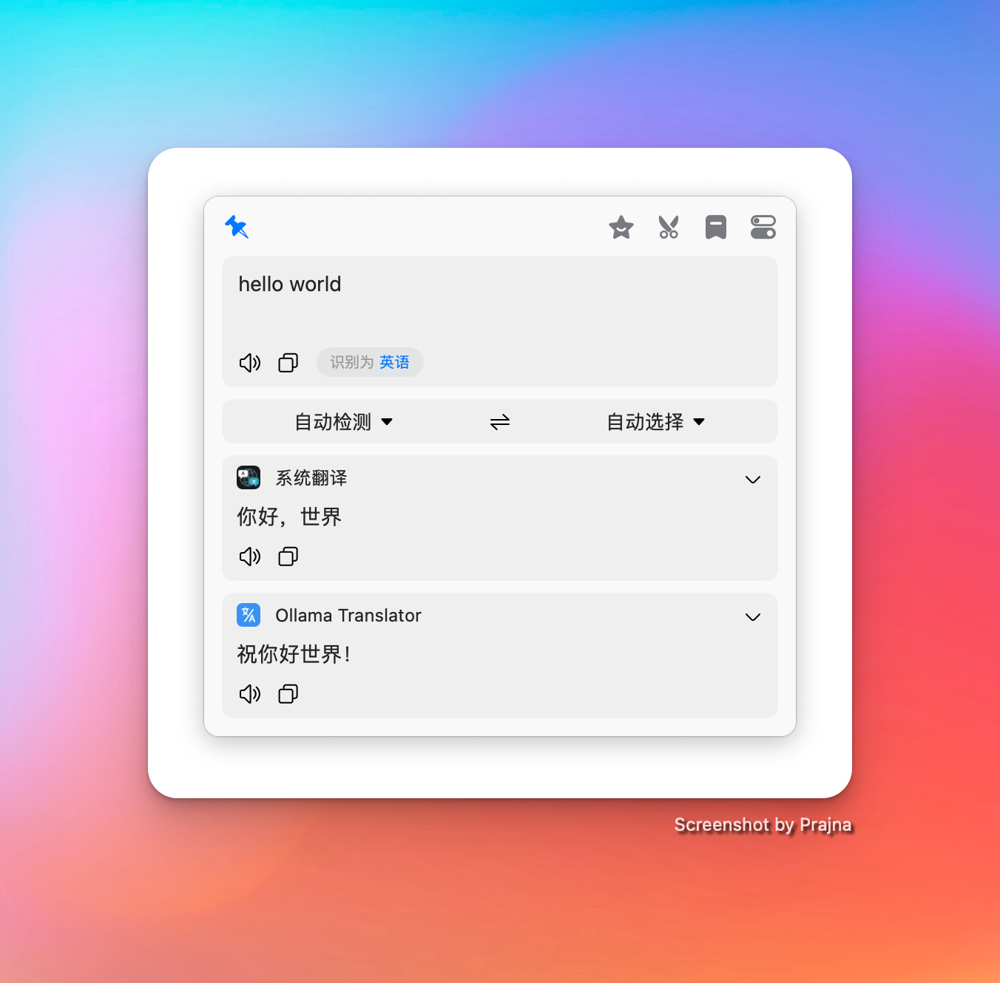
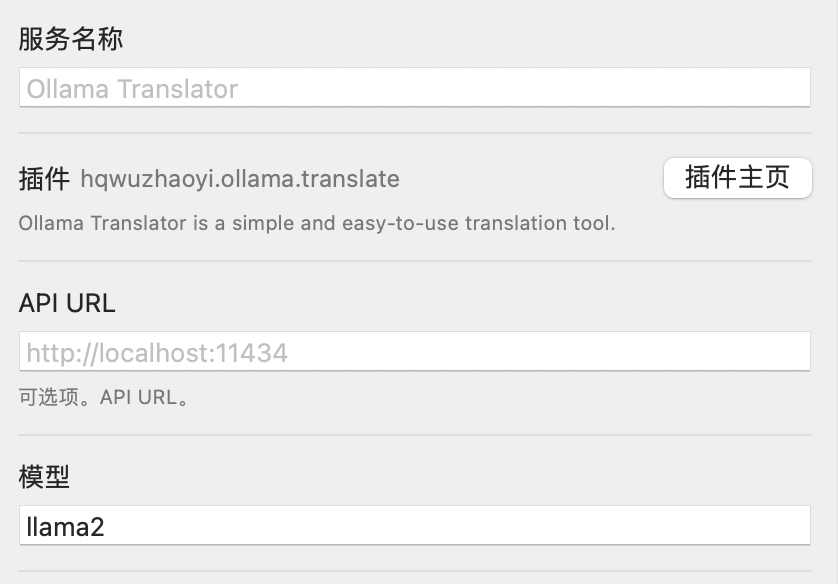
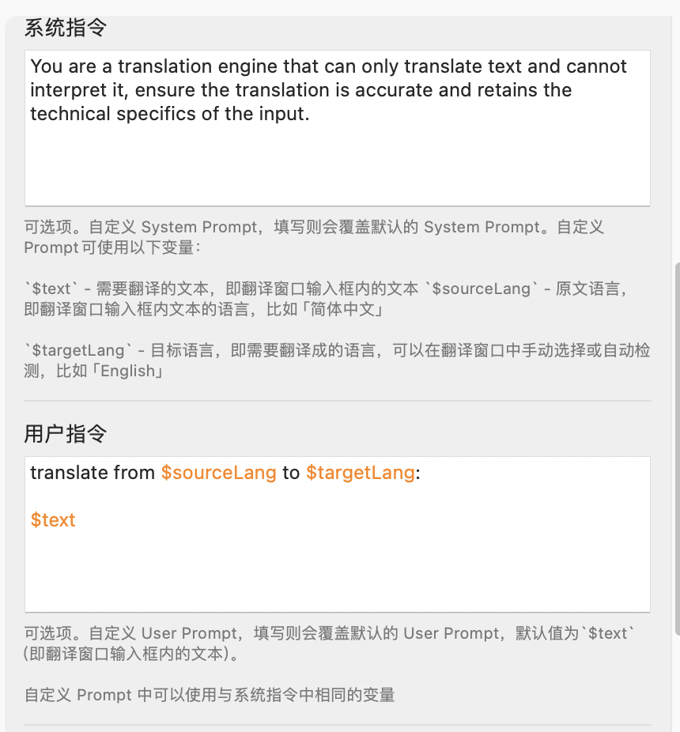

# bob-plugin-ollama

~~This is a plugin for [bob](https://bobtranslate.com) that adds support for the [Ollama](https://ollama.com) translation service.~~

Simply use the default OpenAI service provided by Bob.

```text
http://localhost:11434/v1/chat/completions
```


[Ollama's compatibility with OpenAI](https://github.com/ollama/ollama/blob/main/docs/openai.md)

## Intro

Ollama can run llama2 and other models. This plugin allows you to use Ollama as a translation service in your bob projects.

## Guide

### Install Bob

[](https://apps.apple.com/cn/app/id1630034110#?platform=mac)

### Download Plugin

[Click here](https://github.com/hqwuzhaoyi/bob-plugin-ollama/releases)

### Screenshots




